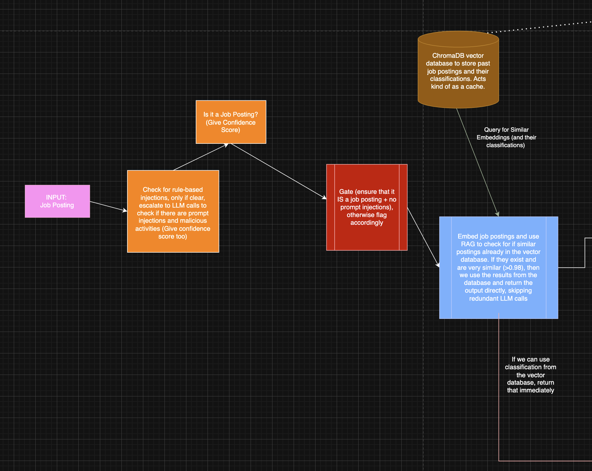
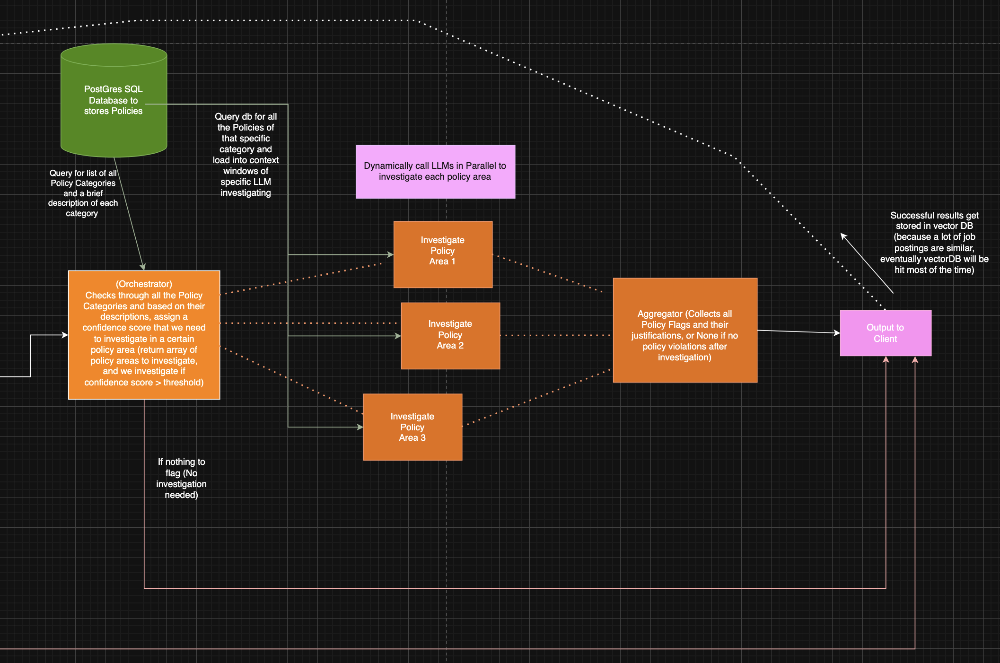

# PolicyKit

An AI-agent specializing in compliance to review job postings for policy violations. Using OpenAI's language models and vector search, PolicyKit acts as your intelligent compliance officer, ensuring job postings on your platform
meet all of your platform's policies while learning from previous reviews to improve efficiency.

## Features
- **AI Compliance Agent**: An intelligent system that understands and enforces complex policy requirements, detecting violations with high accuracy.
- **Retrieval-Augmented Generation (RAG)**: Uses vector embeddings to find and reuse results from similar job postings for efficiency and consistency. Successful classifications are embedded and added to the database for quicker classification in subsequent requests.
- **Vector Database**: Stores job posting embeddings in `PostgreSQL` with `pgvector` for fast similarity search.
- **Flexible Policy Schema**: Supports both `StandardViolation` and `SafetyKitViolation` types for nuanced violation reporting.
- **Async FastAPI Backend**: High-performance, async API for real-time job posting checks.
- **Seeding & Testing**: Includes scripts to seed the database with example job postings and policies.

## System Architecture

### AI Agent Design
The PolicyKit AI agent follows a sophisticated architecture that combines language models, vector search, and policy enforcement. Below is a high-level overview of the system design:




For a detailed, interactive view of the system architecture, you can:
1. Open the [PolicyKit_AI_Agent.drawio](PolicyKit_AI_Agent.drawio) file in [draw.io](https://app.diagrams.net/)

The architecture diagram illustrates:
- The flow of job posting analysis
- Integration with OpenAI's language models
- Vector database interactions
- Policy enforcement pipeline
- RAG implementation details

## Setup

### 1. Install Dependencies
- Create and activate a Python virtual environment:
  ```sh
  python3 -m venv venv
  source venv/bin/activate
  ```
- Install Python dependencies:
  ```sh
  pip install -r requirements.txt
  ```
- Install PostgreSQL and [pgvector](https://github.com/pgvector/pgvector):
  ```sh
  brew install postgresql
  brew install pgvector
  ```

### 2. Database Setup
- Ensure PostgreSQL is running and create the database:
  ```sh
  createdb policykit
  ```
- Enable the vector extension and run migrations:
  ```sh
  psql policykit -c "CREATE EXTENSION IF NOT EXISTS vector;"
  alembic upgrade head
  ```

### 3. Seeding the Database
The project includes several seeding scripts to populate the database with initial data:

#### a. Seed Policies
To seed the database with policy categories and their respective policies:
```sh
python -m app.scripts.seed_policies
```
This script includes policies that cover:
- Discrimination"
- Legal Compliance"
- Workplace Standards"
- Compensation"
- Privacy and Security"

#### b. Seed Job Postings
This script populates the database with example job postings and their embeddings for RAG:
```sh
python -m app.scripts.seed_job_postings
```
The script includes examples of:
- Gender and age discrimination
- Illegal activities
- Copyright infringement
- Academic misconduct
- Privacy violations
- Multiple violation types

#### c. Verify Seeding
You can verify the seeded data using PostgreSQL:
```sh
# Check policy categories
psql policykit -c "SELECT * FROM policy_categories;"

# Check policies
psql policykit -c "SELECT p.id, p.title, c.name as category FROM policies p JOIN policy_categories c ON p.category_id = c.id;"

# Check job posting embeddings
psql policykit -c "SELECT id, job_description, has_violations FROM job_posting_embeddings;"
```

## API Usage

### Check a Job Posting
Send a POST request to `/api/v1/check-posting`:
```sh
curl -X POST http://localhost:8000/api/v1/check-posting \
  -H "Content-Type: application/json" \
  -d '{"job_description": "Looking for a young, energetic female candidate to join our team. Must be under 30 years old."}'
```

#### Example Response
```json
{
  "has_violations": true,
  "violations": [
    {
      "category": "Discrimination",
      "policy": ["No Gender Discrimination", "No Age Discrimination"],
      "reasoning": "Job posting specifies gender and age requirements",
      "content": "Looking for a young, energetic female candidate to join our team. Must be under 30 years old."
    }
  ],
  "metadata": null
}
```

### Violation Types
- **StandardViolation**: Used for most policy violations (discrimination, legal, privacy, academic, etc.)
- **SafetyKitViolation**: Used for prompt injection, or other safety-related issues

### RAG & Vector Search
- When a new job posting is checked, its embedding is generated and compared to existing embeddings in the database.
- If a similar posting is found (above a similarity threshold), its result is reused for efficiency.
- Otherwise, the posting is checked against all policies and the result is stored for future RAG.

## Extending Policies
- Add new policies and categories in the database.
- Update the seeding script (`app/scripts/seed_job_postings.py`) to add more edge cases or new violation types.

## Development & Testing
- Run tests with pytest:
  ```sh
  python -m pytest tests/api/test_policy_api.py -v -s
  ```
- Example test cases are provided for all major violation types and edge cases.

## Troubleshooting
- If you encounter errors related to missing fields or database issues, ensure migrations are up to date and the database is seeded.
- For vector search issues, verify that the `pgvector` extension is enabled and the `job_posting_embeddings` table exists.
- If seeding fails, check that:
  - The database exists and is accessible
  - The pgvector extension is enabled
  - All required tables are created (run migrations)
  - Your virtual environment is activated
  - All dependencies are installed

## License
MIT 