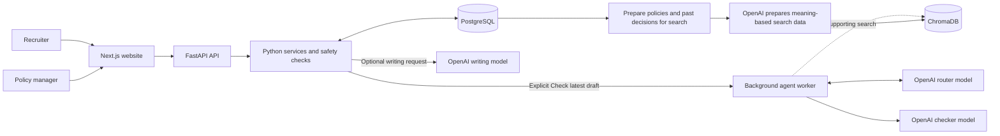
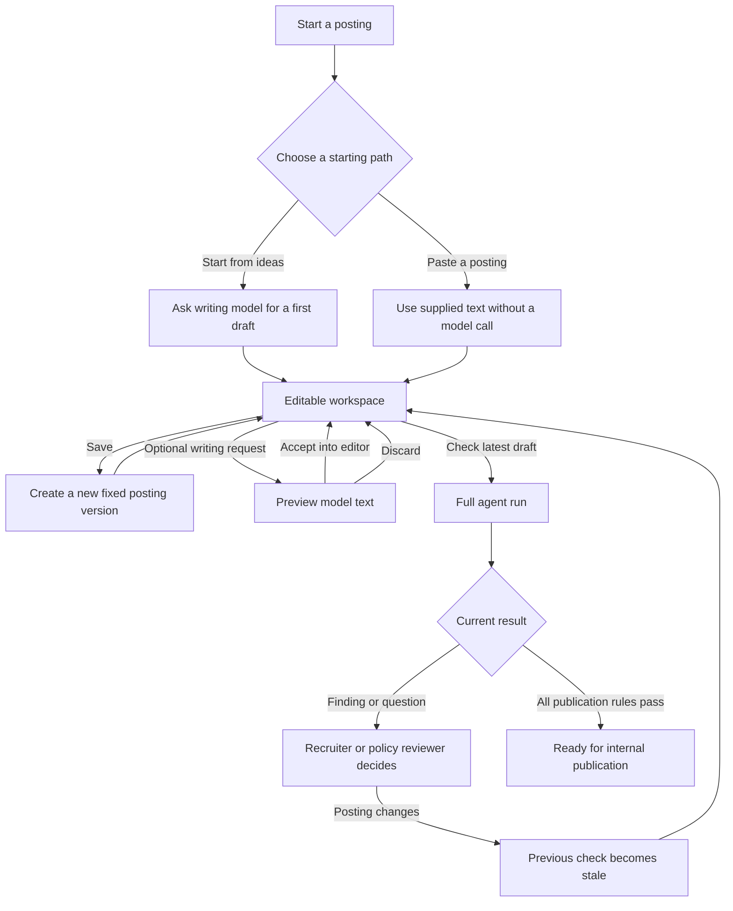

# How PolicyKit works

This guide explains the product and code without assuming prior knowledge.

PolicyKit has two connected jobs:

1. Help a recruiter create and improve a job posting.
2. Check the saved posting against company policies and local requirements before
   publication.

The local requirements in PolicyKit are rules that a policy manager has entered,
reviewed, and published. The app does not search the internet for new laws. A qualified
person must keep the policy library current.

The recruiter controls when models are used. Creating a workspace, typing, saving,
viewing history, and discarding a suggestion do not call OpenAI. Optional writing help
and **Check latest draft** do.

## Terms used in the code

- A **posting** is the job title, organization, hiring locations, employment type, and
  job-description text.
- A **posting version** is one saved copy of the posting text. It does not change after it
  is saved.
- A **session** is the workspace that holds the current posting version, compliance work,
  and human decisions.
- A **policy** is one rule for job postings.
- A **fixed policy set** is a saved copy of the exact rule versions used after a posting
  starts its first compliance check. The code calls it a policy snapshot.
- A **finding** is one policy result and its supporting evidence.
- The **router** is the model that chooses the agent's next allowed action.
- The **checker** is the model that assesses every policy supplied by Python.
- A **reviewed precedent** is an earlier policy decision approved by a person and made
  available as supporting search material.

## System overview



The OpenAI models do not connect to PostgreSQL or publish a posting. They return text,
labeled policy results, or a request to use one allowed tool. Python validates the
result before it changes saved data.

## User flow



### 1. Start from ideas

The recruiter supplies a title and role notes. Organization, locations, and other known
facts can also be supplied. **Generate draft** sends those fields to the OpenAI writing
model. The model is instructed to organize only the supplied facts and not claim that the
result is compliant.

The result is a preview in the browser. The recruiter can edit it before opening a
workspace. Opening the workspace saves version 1. It does not start compliance work.

### 2. Paste an existing posting

The recruiter can paste a complete posting and open the workspace. PolicyKit saves the
text as version 1 without calling OpenAI or starting the agent.

### 3. Edit and save directly

The editor works like a normal text editor. Saving creates version 2, version 3, and so
on. Earlier versions stay unchanged.

Every save includes the identifier of the version that the recruiter loaded. PostgreSQL
locks the session while it saves. If another browser has already saved a newer version,
the old save is rejected instead of overwriting the newer work. The recruiter can then
choose which text to keep.

A recruiter can load earlier text as a new draft. This does not delete any history.
The browser also keeps unsaved editor text on that device. If the recruiter returns after
an accidental navigation or refresh, PolicyKit restores the text. If another browser
saved a newer version, the recruiter must choose which text to keep.

### 4. Ask for optional writing help

Writing help is separate from compliance.

- With a selection, PolicyKit sends the selected text and up to 1,500 characters from
  each side for context. The rest of the draft is not sent.
- Without a selection, PolicyKit sends the full draft. Full-draft help is limited to
  12,000 characters.

PolicyKit checks that the saved base version is still current before and after the model
call. It returns a preview and does not save the model output. The recruiter can accept
the preview into the local editor, edit it again, or discard it. Only a later Save action
creates a posting version.

If the model returns the same text, PolicyKit shows an error instead of presenting an
empty suggestion as a useful change.

### 5. Start the full compliance agent

The recruiter saves the draft and selects **Check latest draft**. This is the explicit
action that starts the full agent.

On the first run, Python saves the latest published rules as a fixed set for that posting.
Later runs keep the same set. This prevents a rule change from altering work already in
progress.

The session enters a waiting list. A background worker takes it and gives the router:

- The complete saved posting.
- Hiring locations, employment type, and platform.
- Current findings and recent activity.
- Only the tools allowed in the current state.

The router must choose exactly one allowed tool. It can request a complete compliance
check, read or search policies, search reviewed precedents, ask the recruiter a question,
propose a limited compliance edit, complete the session, or send it to a person. Python
can offer different tools as the state changes.

### 6. Check every applicable policy

The router cannot choose which required policies to skip. Python resolves the hiring
locations and selects every applicable rule from the posting's fixed policy set. It then
sends the checker:

- The full saved posting text.
- The full text and labeled fields for every applicable policy.

For each policy, the checker returns pass, violation, or uncertain, plus a reason,
confidence, and exact evidence when required.

Python rejects the checker result if:

- An applicable policy is missing.
- A policy appears more than once.
- An unknown policy appears.
- Violation evidence is missing.
- Quoted evidence is not present at the stated location and cannot be repaired safely.

Only validated findings are stored.

### 7. Handle findings and model-proposed text

The agent can read the pinned policy text and use Chroma to find related policies or
reviewed precedents. Search is supporting context only. It does not change the required
policy list or decide that the posting passes.

When the agent proposes a compliance edit, Python reconstructs the new text from declared
replacements. It rejects duplicate source text, overlapping replacements, unsupported
policy references, and changes that do not alter the posting.

The proposed version waits for recruiter approval. Model text is never accepted
automatically. If the recruiter approves it, the explicitly requested review continues
by checking the approved version again. If the recruiter rejects it, the earlier version
remains current and the agent asks what should change.

When a finding needs policy judgment, a policy reviewer can approve an exception, request
changes, or reject the posting. The review request includes the exact posting version the
reviewer saw. The server rejects the decision if the posting changed. A rejected posting
must be edited and saved as a new version before it can be checked again. The human
decision and the exact findings it covered are stored.

## Current and stale results

Every finding is linked to the exact posting version that the checker read. The API
reports one of four check states:

- `never_run`: no version has completed a check.
- `running`: an explicitly requested run is queued or in progress.
- `current`: the last completed check belongs to the current saved version.
- `stale`: a newer posting version exists.

Old findings remain in the audit history but cannot satisfy the publication rules for a
newer version. A stale result does not trigger a model call by itself. The recruiter saves
the new text and selects **Check latest draft** when ready.

## Publication rules

Python marks a posting ready only when:

- Every hiring location is understood.
- At least one policy applies.
- Every applicable policy has exactly one result for the current posting version.
- No unresolved violation or uncertain result remains.
- A person approved the current version if the compliance agent proposed it.

Python evaluates these conditions when the agent requests completion and again when the
recruiter records publication. Direct API calls cannot bypass them. Publication in this
prototype changes only the PolicyKit record; it does not contact a job board.

## What PostgreSQL stores

PostgreSQL is the official record for:

- Policies and all policy versions.
- Fixed policy sets used for past and current reviews.
- Posting metadata and all saved posting versions.
- The current posting-version pointer.
- Agent steps, tool requests, durations, and token counts for router and checker calls.
- Findings and evidence tied to a posting version.
- Proposed compliance changes and recruiter decisions.
- Policy-reviewer decisions and promoted precedents.
- Saved checker results that can be reused only for exact matching inputs.
- Authored evaluation cases.

Saved posting versions and published policy versions are fixed records. New text creates
a new version. PostgreSQL row locks and base-version checks prevent an old browser from
silently replacing a newer version or publishing it with an older result.

Initial writing output and writing-suggestion previews are not saved by their endpoints.
If the recruiter accepts that text and saves the draft, the resulting posting version is
stored. Unsaved editor text is stored only in that browser until it is saved or discarded.

## What ChromaDB stores

ChromaDB stores search copies of published policies and human-reviewed precedent
excerpts. OpenAI turns the text into numbers that can be compared by meaning.
For example, “age preference” can find a policy that mentions “recent graduates.”

Python uses a search result only to find an identifier. It reads the official record from
PostgreSQL and ignores results outside the posting's fixed policy set. ChromaDB is
not required for typing, saving, selecting applicable policies, checking complete policy
coverage, or publishing. Its data can be rebuilt from PostgreSQL.

## Exact checker result reuse

A compliance check uses OpenAI and can cost money. PolicyKit can reuse a saved checker
result only when these inputs match exactly:

- Posting text.
- Fixed policy set.
- Applicable policy-version identifiers.
- Checker model.
- Checker reasoning setting.
- Checker prompt and answer format version.

Python validates a saved answer again before using it. Reusing it records zero new
checker tokens. Router and search steps in the surrounding agent run can still use
OpenAI.

## Failure and retry behavior

- The OpenAI client has a timeout and can retry one provider request up to two times.
- A writing error returns a controlled message. The browser keeps the recruiter's input,
  and the recruiter decides whether to try again.
- Tool errors are recorded and returned to the router as retryable. The router can choose
  another allowed action.
- A full agent run has a step limit. Reaching it sends the session to human review.
- If the worker process stops during a run, work left in progress is returned to the queue
  after the configured stale time.
- If a run still fails, PolicyKit keeps the posting versions and marks the session failed.
  The recruiter can explicitly start another check of the current saved version.

## Privacy and cost boundaries

No OpenAI call occurs when a recruiter types, saves, views history, loads old text,
accepts a preview into the local editor, or discards a preview.

OpenAI receives data only for an AI operation:

- Role fields and notes for initial draft generation.
- Selected text plus nearby context, or the limited full draft, for writing help.
- The full saved posting and session state for routing.
- The full saved posting and applicable policy text for checking.
- Search text for query embeddings.
- Published policy text and reviewed precedent excerpts during indexing.

`OPENAI_STORE_RESPONSES=false` is the default. It controls the request's OpenAI response
storage setting, but data sent to the provider remains subject to its API data rules.

The prototype has output limits, timeouts, limited provider retries, a maximum number of
agent steps, and exact checker result reuse. It does not have sign-in, separation between
customer accounts, rate limiting, or an API spending budget. It must not be exposed to
the public internet or used for confidential production data without those controls.

## Running the worker separately

During local development, the FastAPI process runs the background agent worker by
default. For a separate worker process, set `RUN_AGENT_WORKER=false` for the API process
and run:

```bash
cd server
.venv/bin/python -m app.scripts.run_worker
```

Both processes use the same PostgreSQL database.

## Prototype limits

PolicyKit is a demonstration, not legal advice. It checks only the rules entered and
published by a policy manager; it does not find new laws or confirm that the policy
library is complete. It also has no sign-in, access roles, customer-account separation,
rate limits, production secret management, external job board integration, monitoring,
or data-retention controls. A qualified person must review real policies and publication
decisions.
