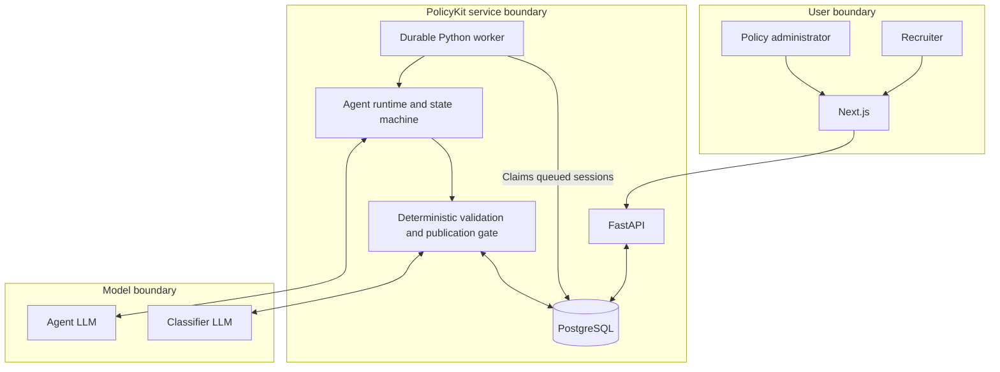
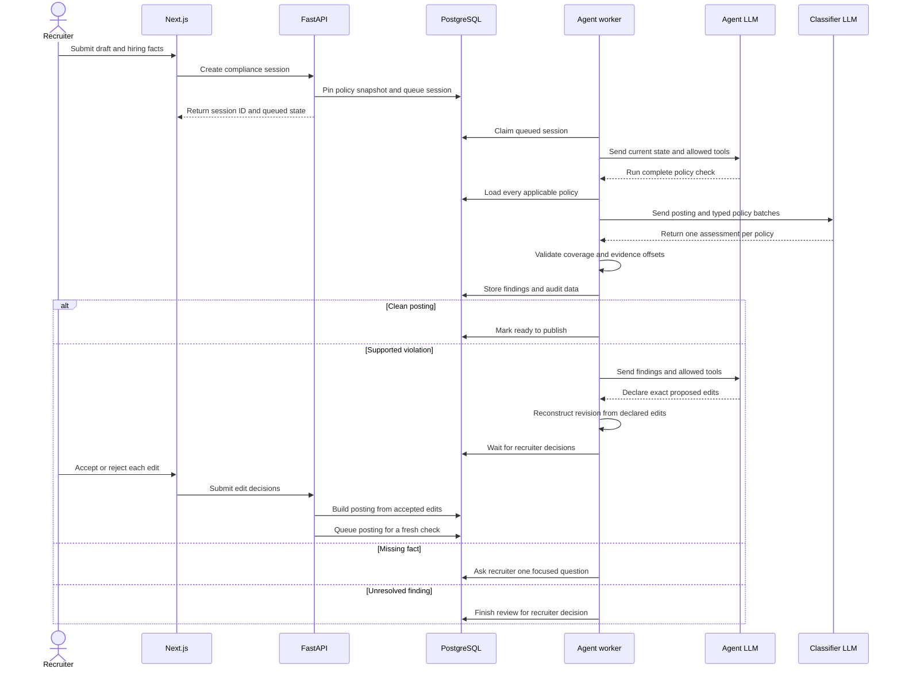

# PolicyKit architecture

## Trust boundary

The Next.js application communicates only with FastAPI. The LLM never has direct access
to PostgreSQL, the filesystem, recruiter decisions, or publication. The Python runtime
validates each model-requested tool against the current session state.

Job descriptions, recruiter messages, and tool output are untrusted data. They cannot
change the runtime instructions or tool permissions. They can still influence model
judgment, so PolicyKit tests its prompt-injection defenses.

## Request sequence

## Two model roles

The orchestrator receives the publication goal, current posting, resolved scope, recent
activity, and current-state tool definitions. It chooses one action. It cannot choose the
applicable policy set or declare a posting publishable by itself.

The classifier runs inside `run_compliance_check`. Python supplies every policy applicable
to the session's immutable snapshot. Policies are processed in bounded batches, and each
batch receives the complete posting. Python combines the responses and requires one typed
assessment per policy. The classifier has no tools and cannot choose a smaller policy set.

## Durable state

PostgreSQL stores:

- Stable policy identities and immutable policy versions
- Policy snapshots used by historical sessions
- Original and agent-authored posting versions
- Agent states, tool inputs and outputs, tokens, latency, and response IDs
- Per-policy assessments and exact evidence offsets
- Proposed changes and recruiter decisions
- Publication overrides and their explanations
- Authored eval cases
- Exact classifier cache entries

The worker claims queued sessions with row locking on PostgreSQL. Each worker iteration
also recovers sessions that remain in `investigating` past the configured stale threshold.

Policy changes lock the stable policy record. Publication takes a PostgreSQL transaction
lock so concurrent policy changes receive distinct snapshot numbers.

## Policy time model

New policy versions cannot be published with a future effective time or an expired end
time. A new snapshot contains only policy versions active at publication time. Each
compliance session evaluates its pinned snapshot at the session start time. This makes an
in-progress review reproducible if a policy expires before the recruiter finishes.

## Exact classifier cache

The exact classifier cache is stored in PostgreSQL. Its key includes the posting text,
policy snapshot, applicable policy IDs, model, prompt namespace, and checker settings. A
cache hit still passes through the normal output validation and records an audit step with
zero model tokens.

## Completion and publication

`complete_session` succeeds only when:

- All hiring locations resolve to known concrete jurisdictions.
- The latest posting version has one assessment for every applicable policy.
- Every assessment is `no_violation`.
- An agent-authored revision has recruiter approval.
- The findings belong to the current posting version and pinned snapshot.

Publication runs the same gate for a clean posting. A recruiter can instead publish with
unresolved findings by providing an override explanation. The explanation is stored in the
audit trail. An override never publishes an unapproved agent revision.

## Revision decisions

The recruiter decides on each proposed edit. The API requires one decision for every
pending edit and rejects incomplete decision sets. If all edits are accepted, the complete
agent draft becomes the current approved posting. If only some edits are accepted, Python
reconstructs a new approved posting from those edits only. If all edits are rejected, the
original posting remains current. Rejected edits and the recruiter note are stored as
feedback. Every result returns to the queue for a new compliance check.

## Failure behavior

- A malformed or incomplete classifier response is rejected before findings are stored.
- Evidence text and offsets must match the exact posting substring.
- The runtime records failed tool calls and includes them in the next agent turn.
- The agent stops with a failure at its configured step limit.
- Interrupted worker sessions return to the queue after the stale threshold.
- External provider failures return controlled API errors and keep database state durable.

## Deployment boundary

The local application can run its worker inside FastAPI. A deployed system can run the API
and worker as separate processes against the same PostgreSQL database.

The prototype has no external identity provider. Production use requires authenticated
recruiter and policy-admin roles, tenant isolation, managed secrets, rate limits,
monitoring, and retention controls.
