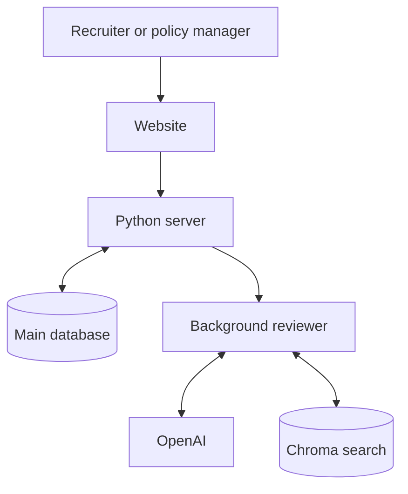
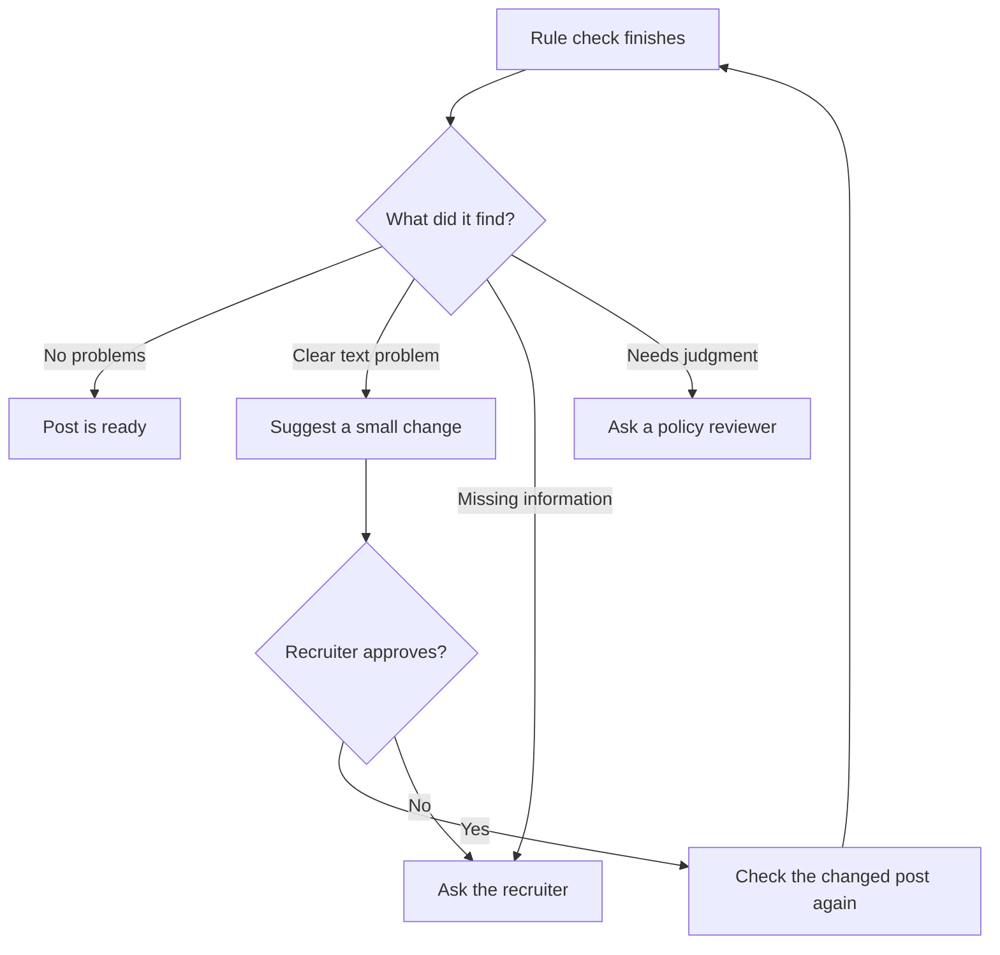

# How PolicyKit works

This page explains the system without assuming that you have read the code.

The code uses some technical names. On this page:

- **Policy** means a rule for job posts.
- **Session** means one review of one job post.
- **Model** means OpenAI software that reads text and returns an answer.
- **Server** means the Python program that receives requests from the website.
- **Database** means the saved records that PolicyKit can read again later.
- **Background reviewer** means the part of the Python program that completes reviews
  after the website sends them.

## The short version

PolicyKit has five main parts:

1. **The website** collects a job post and displays the result.
2. **The Python server** receives requests and enforces the safety rules.
3. **The main database** stores the official rules and every review step.
4. **OpenAI models** choose the next allowed step and compare posts with rules.
5. **ChromaDB** helps find related rule text and past examples.

The OpenAI models never control the database or mark a post as published. They ask Python
to perform an action. Python checks the request before it does anything.

## A job-post review from start to finish

### 1. The recruiter submits the post

The website sends the job text, company name, job type, and hiring locations to the Python
server.

The server creates a review record in PostgreSQL, the main database. It also records the
exact versions of the rules that this review will use.

### 2. The background reviewer starts

A small Python program looks for reviews that are waiting. It takes one review and gives
the next-step OpenAI model:

- The current job post
- The known hiring information
- A short record of recent actions
- The actions that are allowed now

The model must choose one action. For example, it can ask to check the rules or ask the
recruiter for a missing location.

### 3. Python chooses the rules

The model does not choose the required rules.

Python reads the fixed rule list saved when the review started. It selects every rule that
applies to the hiring locations and job type, plus rules that apply to all posts.

### 4. The checking model reads every rule

Python sends the job post and the complete required rule list to a second OpenAI model.
For each rule, this model must return:

- Whether the post passes, fails, or needs human judgment
- The reason
- The exact problem text, when there is a problem
- The location of that text inside the post
- How sure the model is about its answer

### 5. Python checks the answer

Python rejects the answer if:

- A required rule is missing
- A rule appears more than once
- The answer contains a rule that was not requested
- Quoted text does not match the job post
- The quoted text location is wrong and cannot be corrected safely

Only checked answers are saved as results.

### 6. PolicyKit chooses what happens next

## Why a review keeps the same rules

Policy managers can publish new rule versions at any time. The rules used to judge a post
must not change halfway through its review.

PolicyKit therefore saves the exact rule versions when the review begins.

Example:

1. A review starts with Rule A version 2.
2. A policy manager publishes Rule A version 3.
3. The existing review continues with version 2.
4. A new review uses version 3.

This saved list is called a “policy snapshot” in the code. In plain language, it is the
fixed list of rule versions used by one review.

## What is stored in PostgreSQL?

PostgreSQL stores the information that must not be lost:

- Official rules and all published versions
- The fixed rule list for each review
- Original and changed job posts
- Each action requested by the model
- Results, quoted problem text, how long each check took, and which model was used
- Suggested text changes
- Recruiter approvals
- Policy-reviewer decisions
- Test examples
- Reusable results for an identical post and rule list

Published rule text cannot be changed. A new version must be created instead.

If two people try to publish rules or review the same post at the same time, PostgreSQL
makes those updates happen in a safe order. One old browser window cannot overwrite a
newer decision.

## What is ChromaDB used for?

ChromaDB is a search helper. It can find related text even when the wording is different.
For example, a search for “age preference” can find a rule that talks about “recent
graduates.”

ChromaDB stores search copies, not official rules. Python uses each search result to read
the official text from PostgreSQL before showing it to the model.

ChromaDB does not:

- Choose the complete rule list
- Decide whether a post passes
- Replace PostgreSQL
- Publish anything

Its data can be rebuilt from PostgreSQL. The setup instructions in the main README show
the command.

## When is an old result reused?

Checking a post with OpenAI costs time and money. PolicyKit can reuse a saved answer only
when all important inputs are exactly the same:

- Job-post text
- Fixed rule list
- Required rule versions
- OpenAI model
- Model instructions
- Answer format

Python checks a reused answer again before saving it to the new review record. The review
also records that it used the saved result and did not need a new OpenAI call.

## What must be true before a post is ready?

Python checks all of these conditions:

- Every location is understood.
- Every required rule has one result.
- No open problem or unclear answer remains.
- A person approved any model-suggested text.
- The results belong to the current version of the post.

These checks run once when the model says the work is complete and again when someone
asks PolicyKit to record the post as published.

## What happens when something fails?

- An incomplete model answer is rejected.
- A bad text quote is rejected.
- A failed action is saved so the model can choose a better next step.
- A review with too many model steps is sent to a person.
- Work interrupted by a stopped process is returned to the waiting list.
- A failed OpenAI request returns a clear error and does not erase saved work.

## Running the background reviewer separately

For development, the Python server can also run the background reviewer. In a larger
setup, they can run as separate programs while both use the same PostgreSQL database.
The main README contains the command for this setup.

## Limits of the current project

This prototype does not have sign-in or separate customer accounts. Real production use
also needs secure key storage, access checks, request limits, monitoring, and rules for
deleting old data.

The included rules are examples. They are not legal advice.
