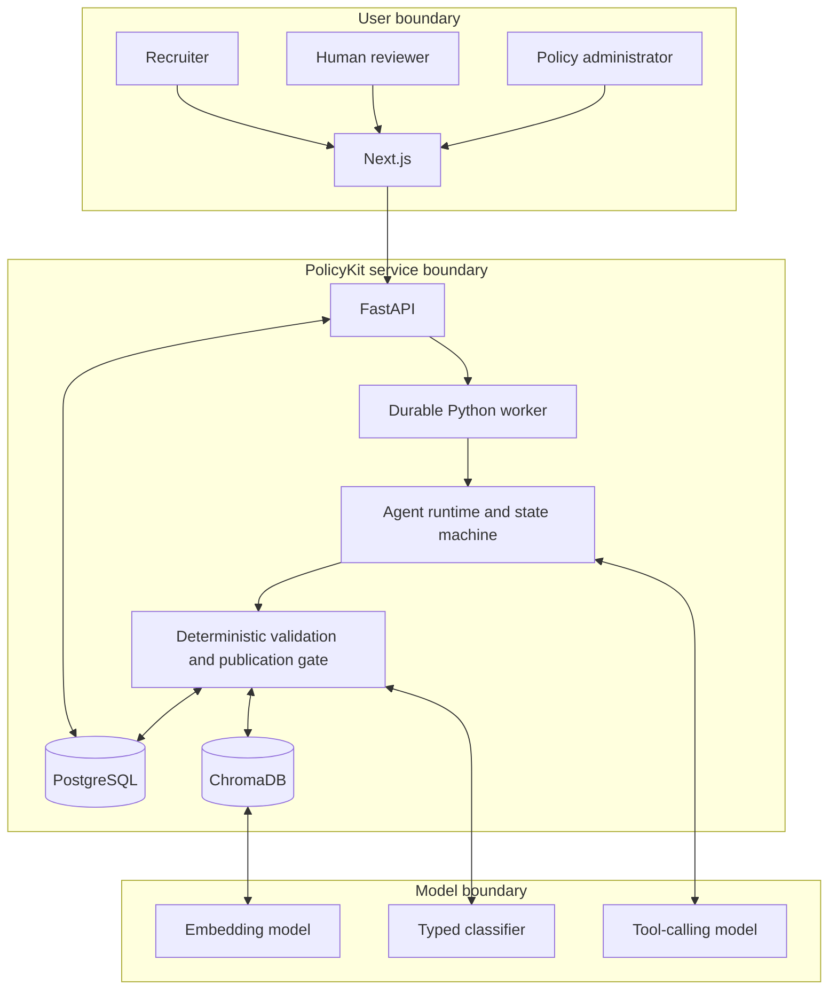
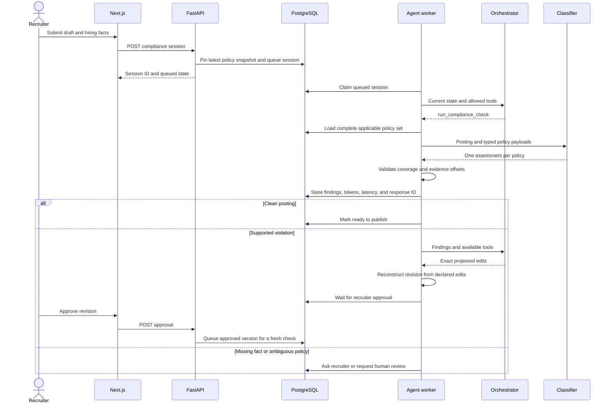

# PolicyKit architecture

## Trust boundary

The Next.js application communicates only with FastAPI. OpenAI never has direct access to
PostgreSQL, ChromaDB, the filesystem, human approval, or publication. The Python runtime
validates each model-requested tool against the current session state.



Job descriptions, recruiter messages, retrieved passages, and tool output are untrusted
data. They cannot change the runtime instructions or tool permissions.

## Request sequence



## Two model roles

The orchestrator receives the publication goal, current posting, resolved scope, recent
activity, and current-state tool schemas. It chooses one action. It does not receive the
full policy catalog and cannot declare a posting compliant by itself.

The classifier runs inside `run_compliance_check`. Python supplies every policy applicable
to the session's immutable snapshot and requires one structured assessment per policy.
The classifier has no tools and cannot choose a smaller policy set.

## Durable state

PostgreSQL stores:

- Stable policy identities and immutable policy versions
- Policy snapshots used by historical sessions
- Original and agent-authored posting versions
- Agent states, tool inputs and outputs, tokens, latency, and response IDs
- Per-policy assessments and exact evidence offsets
- Proposed changes and recruiter approvals
- Human reviews and reviewed precedents
- Authored eval cases
- Exact classifier cache entries

The worker claims queued sessions with row locking on PostgreSQL. Each worker iteration
also recovers sessions that stayed in `investigating` past the configured stale threshold.

Policy changes lock the stable policy record. Publication also takes a PostgreSQL advisory
transaction lock so concurrent policies receive distinct snapshot numbers. Human review
locks and rechecks the session status before writing a decision. These rules prevent stale
clients from modifying published content or overwriting another review.

## Policy time model

New policy versions cannot be published with a future effective time or an expired end
time. A new snapshot contains only policy versions active at publication time. Each
compliance session evaluates its pinned snapshot at the session start time. This makes an
in-progress review reproducible if a policy expires before the recruiter finishes.

## Search and cache

ChromaDB has two derived collections:

- `policy_chunks`
- `reviewed_precedents`

OpenAI embeddings are supplied explicitly. ChromaDB returns candidate IDs and distances.
Python rejects candidates outside the pinned snapshot and returns canonical text from
PostgreSQL. Chroma can be deleted and rebuilt with:

```bash
cd server
.venv/bin/python -m app.scripts.reindex
```

Semantic search supports investigation. It does not narrow the required full-policy check
or produce the final verdict.

The exact classifier cache is stored in PostgreSQL. Its key includes the posting text,
policy snapshot, applicable policy IDs, model, prompt namespace, and checker settings. A
cache hit still passes through the normal output validation and records an audit step with
zero model tokens.

## Completion and publication gates

`complete_session` succeeds only when:

- All hiring locations resolve to known concrete jurisdictions.
- The latest posting version has one assessment for every applicable policy.
- Every assessment is `no_violation`, or a reviewer explicitly resolved it.
- An agent-authored revision has recruiter approval.
- The findings belong to the current posting version and pinned snapshot.

Publication runs the same gate again. A stale status or direct API call cannot bypass full
coverage. Missing or failed work produces a retry, a focused question, a human-review
request, or a failed session.

## Failure behavior

- A malformed or incomplete classifier response is rejected before findings are stored.
- Evidence text and offsets must match the exact posting substring.
- The runtime records failed tool calls and includes them in the next agent turn.
- The agent stops at its configured step limit and sends the session to human review.
- Interrupted worker sessions return to the queue after the stale threshold.
- External provider failures return controlled API errors and keep database state durable.

## Deployment boundary

The local application can run its worker inside FastAPI. A deployed system can run the API
and worker as separate processes against the same PostgreSQL database.

The prototype has no external identity provider. Production use requires authenticated
recruiter, reviewer, and policy-admin roles, tenant isolation, managed secrets, rate limits,
monitoring, and retention controls.
